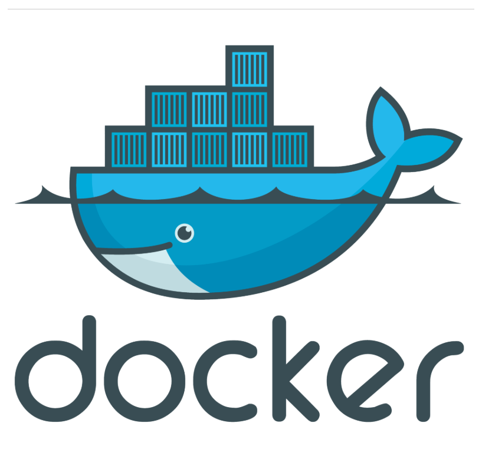

<div/ align="center">

# Docker examples

__General information:__

 ► This is a simple demo code which can helps a QA Automation Engineer to run docker container with Selenium Grid and setting up a QA env much easier than using Vbox/vagrant etc. 
 
 
 ► Тhe rest of the section below shows some simple docker commands and examples :
 

__Postgre DB updates with named volumes__

docker container run -d --name psql -v psql:/var/lib/postgresql/data postgres:9.6.1
docker container logs -f psql -> checking the running container 
ctl+c -> exiting the psql logs terminal

docker container run -d --name psql2 -v psql:/var/lib/postgresql/data postgres:9.6.2
docker container ps -a
docker volume ls

__Starting CentOS & updating the curl__

docker container run --rm -it centOS:7 bash
yum update curl
curl --version

__Starting Ubuntu & update the curl__

docker container run -d --rm -it ubuntu:14.04 bash
apt-get update && apt-get install -y curl
curl --version

__Configuration Round Robin Test && Elasticseach__
docker network create roundRobinTest
docker container run -d --net roundRobinTest --net-alia search elasticsearch:2
docker container run -d --net roundRobinTest --net-alia search elasticsearch:2
docker container ls

** not opening any ports due to the fact that the test will be inside the container network
docker container run --rm --net roundRobinTest alpine nslookup search
Non-authoritative answer:
Name:   search
Address: 172.18.0.2
Name:   search
Address: 172.18.0.3